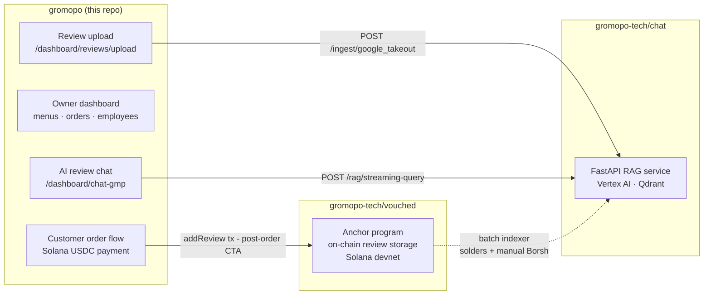

# GroMoPo

[](https://github.com/gromopo-tech/gromopo/actions/workflows/ci.yml)

Solana-based restaurant ordering platform — owners onboard, upload menus, configure a USDC wallet, accept on-chain payments, track orders, and get AI-powered review insights from a multi-source RAG service.

Part of a three-repo system: this app is the customer-facing and owner-facing frontend; [chat](https://github.com/gromopo-tech/chat) is the RAG backend; [vouched](https://github.com/gromopo-tech/vouched) is the on-chain review program.

---

## Screenshots


---

## System Architecture



---

## Tech Stack

| Layer | Technology |
|---|---|
| Framework | Next.js 15 (App Router, Turbopack) |
| Language | TypeScript |
| Auth & DB | Firebase (Auth, Firestore, Storage) + Firebase Admin SDK |
| Solana | `@solana/web3.js`, Wallet Adapter (devnet), SPL Token (USDC payments) |
| UI | Tailwind CSS v4, Radix UI, Sonner toasts |
| Forms | React Hook Form + Zod |
| Data fetching | TanStack React Query |
| RAG backend | [gromopo-tech/chat](https://github.com/gromopo-tech/chat) — FastAPI + Vertex AI + Qdrant |
| On-chain reviews | [gromopo-tech/vouched](https://github.com/gromopo-tech/vouched) — Solana Anchor program |

---

## Repo Layout

```
src/app/(main)/(marketing)/   Public pages — landing, sign-in, sign-up
src/app/(main)/(protected)/   Owner dashboard — menus, orders, employees, AI chat, review upload
src/app/(subdomains)/         Customer-facing order flow, routed by subdomain
src/app/api/                  Next.js API routes — rag-proxy (proxies to chat RAG service)
src/components/               Shared UI components + Solana provider
src/lib/firebase/             Firebase client + Admin SDK config
src/lib/solana/               Solana network config + vouched client
```

---

## Local Setup

### Prerequisites

- Node.js 20+
- Docker (for the RAG backend)
- [Firebase CLI](https://firebase.google.com/docs/cli) (`npm install -g firebase-tools`)
- A funded Solana devnet wallet (for testing on-chain payments)

### 1. Install and configure

```sh
git clone https://github.com/gromopo-tech/gromopo.git
cd gromopo
npm install
```

Create `.env.local`:

```sh
# Firebase emulator overrides (optional — defaults match firebase.json)
NEXT_PUBLIC_FIREBASE_AUTH_EMULATOR_URL=http://127.0.0.1:9099
NEXT_PUBLIC_FIREBASE_EMULATOR_HOST=127.0.0.1
NEXT_PUBLIC_FIREBASE_DB_EMULATOR_PORT=8081
NEXT_PUBLIC_FIREBASE_STORAGE_EMULATOR_PORT=9199

# RAG backend — point at local chat service (see gromopo-tech/chat)
RAG_API_URL=http://localhost:8080

# Review ingest service — shared secret must match INGEST_SHARED_SECRET in the chat repo
RAG_INGEST_URL=http://localhost:8080
INGEST_SHARED_SECRET=dev-secret

# Firebase Admin SDK (for server-side JWT verification)
FIREBASE_ADMIN_PROJECT_ID=<your-project-id>
FIREBASE_ADMIN_CLIENT_EMAIL=<service-account-email>
FIREBASE_ADMIN_PRIVATE_KEY=<service-account-private-key>
```

### 2. Start Firebase emulators and open the app

```sh
firebase emulators:start
```

| Emulator | Default URL |
|---|---|
| Auth | http://127.0.0.1:4000/auth |
| Firestore | http://127.0.0.1:4000/firestore |
| Storage | http://127.0.0.1:4000/storage |

open the app at http://localhost:5002

---

## Demo & Testing

### Merchant Dashboard

The owner dashboard (`/dashboard`) requires a seeded business and an authenticated owner account.

**Create the owner account + set Firebase claims:**

```sh
node seedOwner.js
```

This creates a local emulator user with owner claims for the seeded `sandys-sandies` business. Log in with:

```
Email:    owner@sandys-sandies.test
Password: localtest123
```

After signing in, click on 'Resend verification email', follow the link printed in the emulator terminal, and then click on 'I'm verified -- Continue' or reload the page.

**Seed example business data:**

```sh
# Without a Solana wallet (skips on-chain payment testing)
curl -X POST -H "Content-Type: application/json" \
  http://localhost:5002/api/seed-data

# With a devnet wallet (enables on-chain payment flow)
curl -X POST -H "Content-Type: application/json" \
  -d '{"merchantWallet":"<your-devnet-solana-pubkey>"}' \
  http://localhost:5002/api/seed-data
```

Reload the page and you'll see a link to the ordering page, or the option to create a QR code so that others can scan and place and pay for orders with their solana wallet on their mobile phone.

---

### Customer Ordering (Public Subdomain)

The customer order flow is subdomain-based. Middleware rewrites `<business>.localhost` to the order page — for local testing use the path directly:

```
http://localhost:5002/sandys-sandies/order
```
You can place orders here directly with your Solana wallet on devnet if you have the extension installed on your web browser, or you can generate the QR code and use `ngrok` to test ordering on your mobile phone. Current supported wallets are: Solflare, Phantom, Backpack, MetaMask, and Exodus.


**What to explore:**
- Browse menu and add items to cart
- Connect a Phantom/Backpack wallet (devnet)
- Pay with devnet USDC — transaction lands on Solana devnet
- On the confirmation page, submit an on-chain review via the "Leave a Review" CTA (requires a connected wallet and a `merchantWallet` set on the business)

See [gromopo-tech/vouched](https://github.com/gromopo-tech/vouched) for the on-chain review program.

---

### Review Upload (Self-Serve Ingest)

Owners can upload a Google Business Profile / Takeout JSON export directly from the dashboard at `/dashboard/reviews/upload`. The file is parsed client-side (preview shows count, average rating, date range), then forwarded to the chat service's `/ingest/google_takeout` endpoint.

Requires the [chat](https://github.com/gromopo-tech/chat) service running and `RAG_INGEST_URL` + `INGEST_SHARED_SECRET` set in `.env.local` (see above). Re-uploads are idempotent — duplicate reviews are overwritten, not added twice.

**How to get the export file:** sign in to `business.google.com`, then use `takeout.google.com` to export Google Business Profile data. The file is `Takeout/Google Business Profile/reviews.json` inside the downloaded archive. Click "How do I get this file?" in the dashboard for step-by-step instructions.

---

### AI Review Chat

The AI chat feature (`/dashboard/chat-gmp`) queries a RAG backend built on Vertex AI + Qdrant. It requires the [chat](https://github.com/gromopo-tech/chat) service to be running.

**Start the RAG backend:**

```sh
# From the chat repo — see https://github.com/gromopo-tech/chat for full setup
docker-compose up -d
```

Confirm it's healthy:

```sh
curl http://localhost:8080/health
```

**Ingest reviews into the vector store:**

Option A — owner dashboard (no CLI needed): log in, go to `/dashboard/reviews/upload`, drop in your `reviews.json`.

Option B — CLI (from the chat repo):

```sh
# Google Takeout reviews
python3 ingest/run_ingest.py --source google_takeout --business-id sandys-sandies

# On-chain Solana reviews
python3 ingest/run_ingest.py --source onchain_solana --business-id sandys-sandies --reviewee <merchant-pubkey>
```

**What to explore:**
- Log in as the seeded owner and navigate to `/dashboard/chat-gmp`
- Ask natural-language questions about customer reviews (e.g. "What do customers say about the sandwiches?")
- Responses stream in real-time and cite source reviews

---

## Related Repos

| Repo | Role |
|---|---|
| [gromopo-tech/chat](https://github.com/gromopo-tech/chat) | Python/FastAPI RAG service — Vertex AI embeddings, Qdrant vector store, LLM-driven query parser, multi-source ingestion |
| [gromopo-tech/vouched](https://github.com/gromopo-tech/vouched) | Solana Anchor program — purchase-verified on-chain review storage, PDA-based accounts, devnet deployment |
