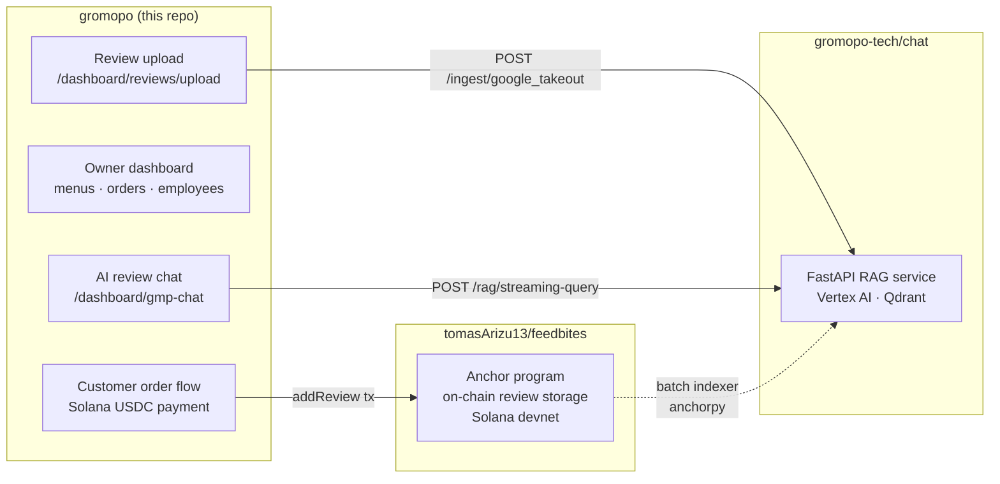

# Gromopo

Solana-based restaurant ordering platform — owners onboard, upload menus, configure a USDC wallet, accept on-chain payments, track orders, and get AI-powered review insights from a multi-source RAG service.

Part of a three-repo system: this app is the customer-facing and owner-facing frontend; [chat](https://github.com/gromopo-tech/chat) is the RAG backend; [feedbites](https://github.com/tomasArizu13/feedbites) is the on-chain review program.

---

## Screenshots


---

## System Architecture



---

## Tech Stack

| Layer | Technology |
|---|---|
| Framework | Next.js 15 (App Router, Turbopack) |
| Language | TypeScript |
| Auth & DB | Firebase (Auth, Firestore, Storage) + Firebase Admin SDK |
| Solana | `@solana/web3.js`, Wallet Adapter (devnet), SPL Token (USDC payments) |
| UI | Tailwind CSS v4, Radix UI, Sonner toasts |
| Forms | React Hook Form + Zod |
| Data fetching | TanStack React Query |
| RAG backend | [gromopo-tech/chat](https://github.com/gromopo-tech/chat) — FastAPI + Vertex AI + Qdrant |
| On-chain reviews | [tomasArizu13/feedbites](https://github.com/tomasArizu13/feedbites) — Solana Anchor program |

---

## Repo Layout

```
src/app/(main)/(marketing)/   Public pages — landing, sign-in, sign-up
src/app/(main)/(protected)/   Owner dashboard — menus, orders, employees, AI chat, review upload
src/app/(subdomains)/         Customer-facing order flow, routed by subdomain
src/app/api/                  Next.js API routes — rag-proxy, reviews/ingest
src/components/               Shared UI components + Solana provider
src/lib/firebase/             Firebase client + Admin SDK config
src/lib/solana/               Solana network config + feedbites client
```

---

## Local Development

### Prerequisites

- Node.js 20+
- [Firebase CLI](https://firebase.google.com/docs/cli) (`npm install -g firebase-tools`)
- A funded Solana devnet wallet (for testing payments)

### 1. Clone

```sh
git clone https://github.com/gromopo-tech/gromopo.git
cd gromopo
npm install
```

### 2. Start Firebase emulators

```sh
firebase emulators:start
```

Default ports (can be overridden via `.env.local`):

| Emulator | Default |
|---|---|
| Auth | http://127.0.0.1:9099 |
| Firestore | http://127.0.0.1:8081 |
| Storage | http://127.0.0.1:9199 |

### 3. Configure environment variables

Create `.env.local`:

```sh
# Firebase emulator overrides (optional — defaults match firebase.json)
NEXT_PUBLIC_FIREBASE_AUTH_EMULATOR_URL=http://127.0.0.1:9099
NEXT_PUBLIC_FIREBASE_EMULATOR_HOST=127.0.0.1
NEXT_PUBLIC_FIREBASE_DB_EMULATOR_PORT=8081
NEXT_PUBLIC_FIREBASE_STORAGE_EMULATOR_PORT=9199

# RAG backend — point at local chat service (see gromopo-tech/chat)
RAG_API_URL=http://localhost:8080/rag

# Firebase Admin SDK (for server-side JWT verification)
FIREBASE_ADMIN_PROJECT_ID=<your-project-id>
FIREBASE_ADMIN_CLIENT_EMAIL=<service-account-email>
FIREBASE_ADMIN_PRIVATE_KEY=<service-account-private-key>
```

### 4. Run the dev server

```sh
npm run dev
```

App is available at http://localhost:3000.

Subdomain-based order pages are rewritten by middleware — test locally at `http://localhost:3000/<subdomain>/order`.

### 5. (Optional) Start the RAG backend

To use the AI chat dashboard feature, run the chat service locally:

```sh
# see https://github.com/gromopo-tech/chat for setup
docker-compose up -d   # from the chat repo
```

Then set `RAG_API_URL=http://localhost:8080/rag` in `.env.local`.

---

## Related Repos

| Repo | Role |
|---|---|
| [gromopo-tech/chat](https://github.com/gromopo-tech/chat) | Python/FastAPI RAG service — Vertex AI embeddings, Qdrant vector store, LLM-driven query parser, multi-source ingestion |
| [tomasArizu13/feedbites](https://github.com/tomasArizu13/feedbites) | Solana Anchor program — on-chain review storage, PDA-based accounts, devnet deployment |
